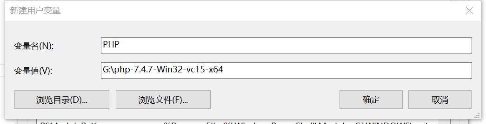
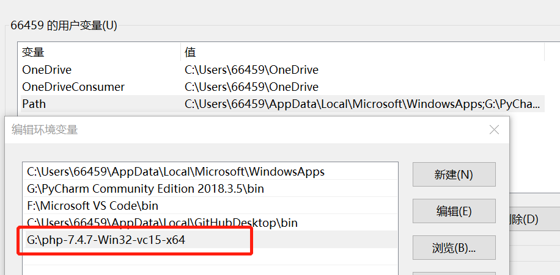
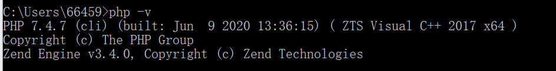
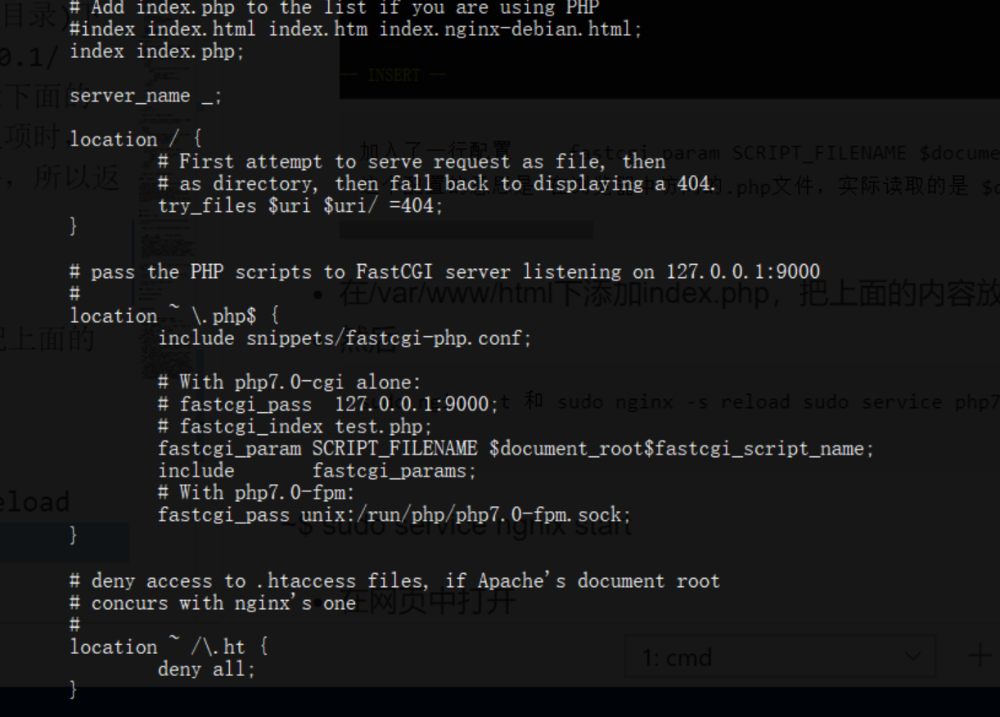

# 实验01 XSS攻击

## 实验要求

编写并且运行含有漏洞的简单页面，实现XSS攻击

## 实验环境

- Windows10系统 
- Linux系统

## 实验过程

### Windows

- Apache/Nginx + php
- php + vscode的php插件

#### 用vscode php插件进行环境搭建

##### Install PHP

- [php下载](https://windows.php.net/download/)版本`php-7.4.7-Win32-vc15-x64 Thread Safe`

- 将 PHP 目录下的 php.ini-development生成副本并改名为 php.ini，作为PHP的配置文件

- 用记事本打开php.ini，修改配置信息:（<u>*这一步后来我发现应该用vscode打开，就可以使用查找功能*</u>）

  - 取消`; extension_dir = "ext" `的注释（实在太难找了）

    

  - 取消

     `extension=curl `

    `extension=gd2 `

    `extension=mbstring `

    `extension=mysql `

    `extension=pdo_mysql `

    `extension=xmlrpc`的注释

- ##### 将php的路径添加至环境变量



发现没有成功，原来是因为要配置在path下，不能新建。



配置成功



- 在vscode中装扩展PHP Server

##### XSS攻击实验

index.html文件：

```
<html>
<body>
    <form method="post" action="index.php">
        <input type="text" name="name">
        <button>提交</button>
    </form>
</body>
</html>
```

index.php文件：

```
<?php
    $name= $_POST["name"];
    echo "welcome $name";
?>
```

### Linux

#### Nginx + php

- 安装

  ```
  sudo apt-get update
  sudo apt-get install nginx
  sudo apt-get install php
  ```

- 把/etc/nginx/sites-available/default的index修改

```
加入一行配置 　　fastcgi_param SCRIPT_FILENAME $document_root$fastcgi_script_name;
```



- index.php

  ```
  <html>
    <body>
        <form name="form" method="post" action="">
            <input type="text" name="name">
            <input type="submit" name="submit">
        </form>
        <?php
            if(isset($_POST["name"]) && $_POST["submit"]=="Submit Query"){
                $name=$_POST["name"];
                echo "welcome $name";
            }
        ?>
    </body>
  </html>
  ```

- 把输入指令后在网页中打开即可。

```
sudo nginx -t
sudo nginx -s reload 
sudo service php7.0-fpm start
```