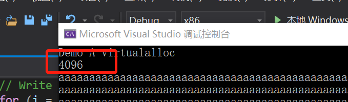
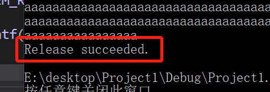
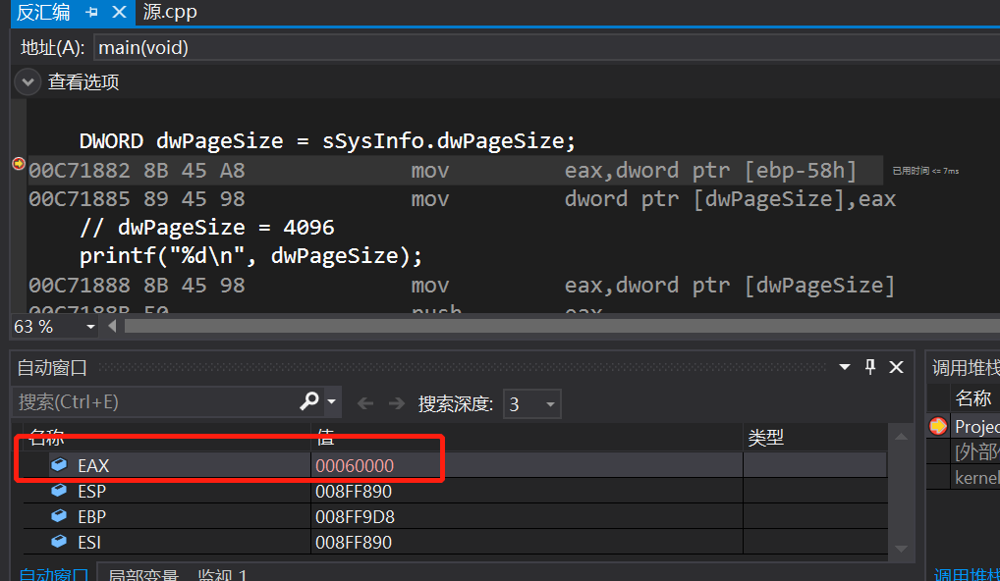

# 实验04、05 内存管理

## 实验要求

1. 验证不同进程的相同的地址可以保存不同的数据。

   （1）在VS中，设置固定基地址，编写两个不同可执行文件，同时运行这两个文件。

   （2）使用调试器附加到两个程序的进程，查看内存，看两个程序是否使用了相同的内存地址；

   （3）在不同的进程中，尝试使用VirtualAlloc分配一块相同地址的内存，写入不同的数据。再读出。

2. 配置一个Windbg双机内核调试环境，

   （1）Windbg如何在内核调试情况下看物理内存。

   （2）查看进程的虚拟内存分页表，在分页表中找到物理内存和虚拟内存的对应关系。

   （3）然后通过Windbg的物理内存查看方式和虚拟内存的查看方式，看同一块物理内存中的数据情况

## 实验代码

#### 使用VirtualAlloc分配一块相同地址的内存，写入不同的数据再读出

```
#include <windows.h>
#include <tchar.h>
#include <stdio.h>
#include <stdlib.h>             // For exit

int main() {
	printf("Demo A virtualalloc\n");

	LPVOID lpvBase;               // Base address of the test memory
	LPTSTR lpPtr;                 // Generic character pointer
	BOOL bSuccess;                // Flag
	DWORD i;                      // Generic counter
	SYSTEM_INFO sSysInfo;         // Useful information about the system

	GetSystemInfo(&sSysInfo);     // Initialize the structure.

	DWORD dwPageSize = sSysInfo.dwPageSize;
	// dwPageSize = 4096
	printf("%d\n", dwPageSize);

	// Reserve pages in the virtual address space of the process.
	int PAGELIMIT = 1;

	lpvBase = VirtualAlloc(
		(LPVOID)0x40000000,                 // System selects address
		PAGELIMIT*dwPageSize, // Size of allocation
		MEM_RESERVE | MEM_COMMIT,          // Allocate reserved pages
		PAGE_READWRITE);       // Protection = no access
	if (lpvBase == NULL)
	{
		_tprintf(TEXT("Error! %s with error code of %ld.\n"), TEXT("VirtualAlloc reserve failed."), GetLastError());
		exit(0);
	}

	lpPtr = (LPTSTR)lpvBase;

	// Write to memory.
	for (i = 0; i < PAGELIMIT*dwPageSize; i++) {
		lpPtr[i] = 'a';
	}

	// Read from memory
	for (i = 0; i < PAGELIMIT*dwPageSize; i++) {
		printf("%c", lpPtr[i]);
	}

	bSuccess = VirtualFree(
		lpvBase,       // Base address of block
		0,             // Bytes of committed pages
		MEM_RELEASE);  // Decommit the pages

	_tprintf(TEXT("\nRelease %s.\n"), bSuccess ? TEXT("succeeded") : TEXT("failed"));

	return 0;
}
```

## 实验过程

##### 编程使用malloc分配一段内存，测试是否这段内存所在的整个4KB都可以写入读取

每个char字符占一个字节，总字节数是4096个



运行程序结束，4KB空间都可以进行读取释放



- `61h`是a的ascii值的16进制

- 00C71882 8B 45 A8             mov         eax,dword ptr [ebp-58h]  

  代码执行完这句后，去查看eax寄存器的值，存的是a所在的地址

  

此时调试B_demo，b也可以写入

相同内存地址存入了不同的数据，证明不同进程相同内存地址可以保存不同的数据

##### 使用VirtualAlloc分配一段，可读可写的内存，写入内存，然后将这段内存改为只读，再读数据和写数据，看是否会有异常情况。然后VirtualFree这段内存，再测试对这段内存的读写释放正常

使用 VirtualProtect 修改一段内存的访问属性

- 函数：VirtualProtect (PVOID 基地址，SIZE_T 大小，DWORD 新属性，DWORD 旧属性)

  ```
  vp = VirtualProtect(
    lpv,
    PAGELIMIT * dwPageSize,	 // 需要改变访问属性的区域大小
    PAGE_READONLY,           // 只读
    &oldProtect	             // 在修改前，旧的访问属性将被存储
  );
  ```

- 更改一页的页面属性，改为只读后无法访问，还原后可以访问

  ```
  DWORD protect;
  iP[0]=8;
  VirtualProtect(lpv,4096,PAGE_READONLY,&protect);
  int * iP=(int*)pV;
  iP[1024]=9;                //可以访问，因为在那一页之外
                             //iP[0]=9;不可以访问，只读
  //还原保护属性
  VirtualProtect(lpv,4096,PAGE_READWRITE,&protect);
  cout<<"初始值="<<iP[0]<<endl;    //可以访问
  ```

  - 结果：将访问属性修改为 PAGE_READONLY 后，该段内存无法写入，但可以正常读取

- 释放内存代码

```
//只释放物理内存
VirtualFree((int*)pV+2000,50*1024*1024,MEM_DECOMMIT);
int* a=(int*)pV;
a[10]=2;//可以使用，没有释放这一页
MEMORYSTATUS memStatusVirtual3;
GlobalMemoryStatus(&memStatusVirtual3);
cout<<"物理内存释放："<<endl;
cout<<"增加物理内存="<<memStatusVirtual3.dwAvailPhys-memStatusVirtual2.dwAvailPhys<<endl;
cout<<"增加可用页文件="<<memStatusVirtual3.dwAvailPageFile-memStatusVirtual2.dwAvailPageFile<<endl;
cout<<"增加可用进程空间="<<memStatusVirtual3.dwAvailVirtual-memStatusVirtual2.dwAvailVirtual<<endl<<endl;
```

- 结果：内存释放后将无法读取和写入

