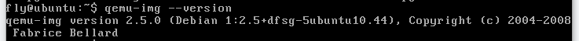
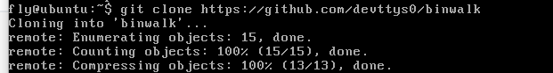
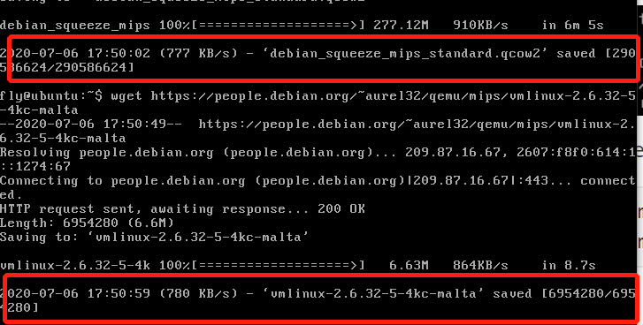
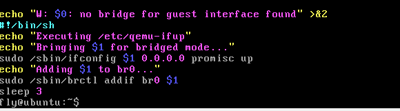

# 实验07 Fuzzing

模糊测试技术是一种通过注入缺陷实现的自动化软件测试技术。其基础是在执行时将包括无效的、意外的或随机的数据输入注入到程序中，监视程序是否出现崩溃等异常，以获取意外行为并识别潜在漏洞。

## 实验要求

- 搜集市面上主要的路由器厂家、在厂家的官网中寻找可下载的固件。在CVE漏洞数据中查找主要的家用路由器厂家的已经公开的漏洞，选择一两个能下载到切有已经公开漏洞的固件。如果能下载对应版本的固件，在QEMU中模拟运行。确定攻击面（对哪个端口那个协议进行Fuzzing测试），尽可能多的抓取攻击面正常的数据包（wireshark）。
- 查阅BooFuzz的文档，编写针对这个攻击面，这个协议的脚本，进行Fuzzing。
- 配置BooFuzz QEMU的崩溃异常检测，争取触发一次固件崩溃，获得崩溃相关的输入测试样本和日志。
- 尝试使用调试器和IDA-pro监视目标程序的崩溃过程，分析原理。

## 实验环境

- Ubuntu16.04 server

（因为之前用的desktop版apt-get挂掉了，所以重新在virtualbox上安装了server版……）

## 实验过程

1、安装QEMU

```
sudo apt-get install zlib1g-dev
sudo apt-get install libglib2.0-0
sudo apt-get install libglib2.0-dev
sudo apt-get install libtool
sudo apt-get install libsdl1.2-dev
sudo apt-get install libpixman-1-dev
sudo apt-get install autoconf
sudo apt-get install qemu
sudo apt-get install qemu-user-static
sudo apt-get install qemu-system
```

安装成功，可以看到版本信息：



2、安装 binwalk

```
sudo apt-get install python-lzma
sudo apt-get install build-essential autoconf git
git clone https://github.com/devttys0/binwalk
```



3、从[站点](https://people.debian.org/~aurel32/qemu/mips/)下载debianmips qemu镜像：debian_squeeze_mips_standard.qcow2和vmlinux-2.6.32-5-4kc-malta

```
wget https://people.debian.org/~aurel32/qemu/mips/debian_squeeze_mips_standard.qcow2
wget https://people.debian.org/~aurel32/qemu/mips/vmlinux-2.6.32-5-4kc-malta
```



4、MIPS系统网络配置

- 使用QEMU 模拟运行MIPS系统，需要将ubuntu虚拟机设置成桥接，这样以来ubuntu系统就可以和QEMU虚拟机进行通信和数据传输。

- 获取安装依赖，执行以下命令：

  ```
  sudo apt-get install bridge-utils uml-utilities
  ```

- 修改ubuntu主机网络配置，修改ubuntu的网络接口配置文件

  ```
  sudo vim /etc/network/interfaces
  #打开后将内容删除，改为如下：
  auto lo
  iface lo inet loopback
  
  auto ens33
  iface ens33 inet manual
  
  auto br0
  iface br0 inet dhcp
  bridge_ports ens33
  bridge_maxwait 0
  ```

- 修改QEMU的网络接口启动脚本，重启网络使配置生效，执行以下命令：

  ```
  sudo vim /etc/qemu-ifup
  #在脚本文件/etc/qemu-ifup结尾增加如下内容：
  #!/bin/sh
  echo "Executing /etc/qemu-ifup"
  echo "Bringing $1 for bridged mode..."
  sudo /sbin/ifconfig $1 0.0.0.0 promisc up
  echo "Adding $1 to br0..."
  sudo /sbin/brctl addif br0 $1
  sleep 3
  ```



保存文件/etc/qemu-ifup 以后，赋予可执行权限，然后重启网络使所有的配置生效：

```
sudo chmod a+x /etc/qemu-ifup
sudo /etc/init.d/networking restart
```

5、QEMU启动配置

- Qemu运行之前先启动桥接网络，在本地ubuntu命令行终端执行以下命令

  - ens33为ubuntu默认网卡

  ```
  sudo ifdown ens33
  sudo ifup br0
  ```

6、QEMU MIPS虚拟机启动

- 进入前面下载的mips镜像目录，执行以下命令：

  ```
  sudo qemu-system-mips -M malta -kernel vmlinux-2.6.32-5-4kc-malta -hda debian_squeeze_mips_standard.qcow2 -append "root=/dev/sda1 console=tty
  ```

输入root/root便可登入qemu mips虚拟机

7、借助firmadyne工具运行固件

```
git clone --recursive https://github.com/attify/firmware-analysis-toolkit.git
```