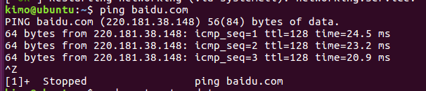
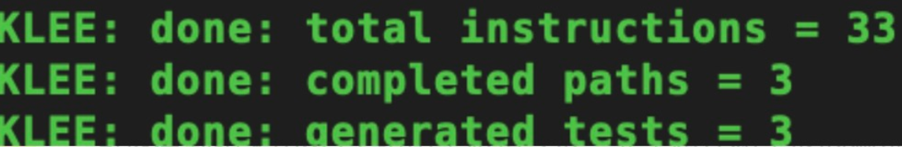
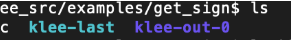
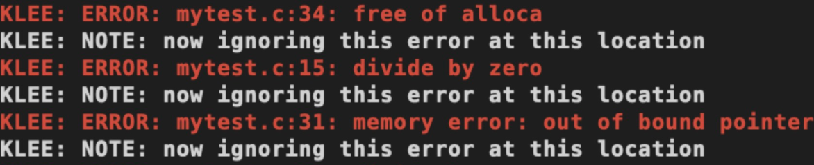
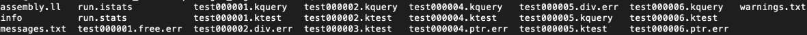
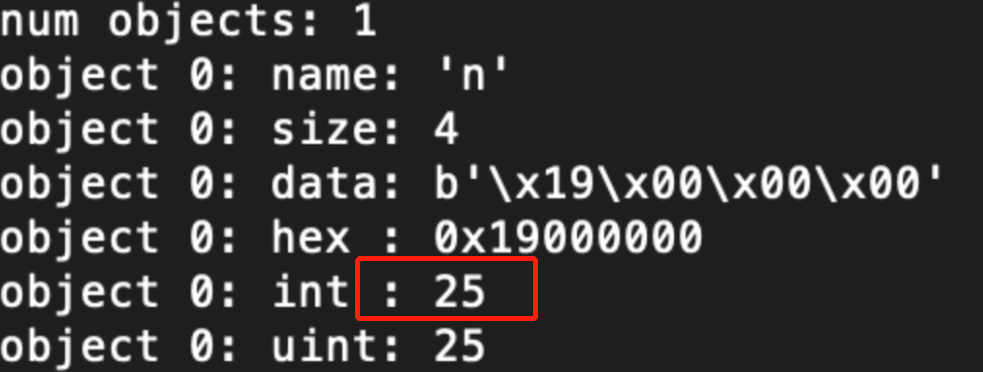

# 实验08 KLEE

## KLEE的使用 

1、创建基本容器

```
$ docker run --rm -ti --ulimit='stack=-1:-1' klee/klee
```

2、创建永久容器

```
$ docker run -ti --name=my_first_klee_container --ulimit='stack=-1:-1' klee/klee:2.0
```

没有用--rm参数，因此创建了永久容器。

--name参数指定了容器的名字。

--ulimit参数防止堆栈溢出问题。

```
$ exit
$ docker ps -a
```

重新再进入容器

```
$ docker start -ai my_first_klee_container
```

删除命令：

```
$ docker rm my_first_klee_container
```

这个 程序一般在 examples/get_sign目录下，用来判断一个整数的正，负，或者为0。

```c
#include <klee/klee.h>
 
int get_sign(int x) {
  if (x == 0)
     return 0;
  
  if (x < 0)
     return -1;
  else 
     return 1;
} 
 
int main() {
  int a;
  klee_make_symbolic(&a, sizeof(a), "a");
  return get_sign(a);
}
```

其中，klee_make_sybolic是KLEE自带的函数，用来产生符号化的输入。

## Docker

- Docker 在容器的基础上，进行了进一步的封装，从文件系统、网络互联到进程隔离等等，极大的简化了容器的创建和维护。使得 Docker 技术比虚拟机技术更为轻便、快捷

## LLVM

- llvm是low level virtual machine的简称，其实是一个编译器框架
- llvm的主要作用是它可以作为多种语言的后端，它可以提供可编程语言无关的优化和针对很多种CPU的代码生成功能
- 此外llvm目前已经不仅仅是个编程框架，它目前还包含了很多的子项目，比如clang

## 实验准备

首先为ubuntu连网：

打开Ubuntu的终端，输入：

```
sudo gedit /etc/network/interfaces 
```

表示使用gedit编辑器打开interfaces文件。 

在打开的文件中，若有内容，先全部删除。然后输入如下代码：

```
auto lo 
iface lo inet loopback

auto ens33 
iface ens33 inet static 
address 192.168.8.100 
netmask 255.255.255.0 
gateway 192.168.8.2
```

然后，配置DNS服务器：

```
sudo gedit /etc/resolv.conf
```

在里面填入阿里的

```
DNS 223.5.5.5
nameserver 223.5.5.5
```

关闭gedit（先保存，后关闭），然后，在命令行中输入：

```
sudo /etc/init.d/networking restart 
```

重启网络即可。可以ping通百度，说明网络连接正常了。



- 安装docker

  ```
    #更新apt包索引：
    $ sudo apt-get update
    #安装以下包以使apt可以通过HTTPS使用存储库（repository）：
    $ sudo apt-get install -y apt-transport-https ca-certificates curl software-properties-common
    #添加Docker官方的GPG密钥：
    $ curl -fsSL https://download.docker.com/linux/ubuntu/gpg | sudo apt-key add -
    #使用下面的命令来设置stable存储库：
    $ sudo add-apt-repository "deb [arch=amd64] https://download.docker.com/linux/ubuntu $(lsb_release -cs) stable"
    #再更新一下apt包索引：
    $ sudo apt-get update
    #安装最新版本的Docker CE：（需要一定时间）
    $ sudo apt-get install -y docker-ce
  ```

- 查看docker服务是否启动

  ```
  $ systemctl status docker
  ```

- 在docker中安装klee

  ```
  docker pull klee/klee:2.0
  ```

## 实验过程

### tutorial 1

示例代码`get_sign.c`在 `/klee_src/examples/get_sign` 目录下，用来判断一个整数的正，负，或者为0.

```
#include <klee/klee.h>
int get_sign(int x) {
  if (x == 0)
     return 0;
  if (x < 0)
     return -1;
  else 
     return 1;
} 
int main() {
  int a;
  klee_make_symbolic(&a, sizeof(a), "a");
  return get_sign(a);
}
```

将.c编译为LLVM字节码:

```
clang -I ../../include -emit-llvm -c -g -O0 -Xclang -disable-O0-optnone get_sign.c
```

运行KLEE `klee get_sign.bc`

- 结果中KLEE给出了总指令数，完整路径和生成的测试案例数。 



当前目录下多生成了两个文件：klee-last 和 klee-out-0

- 其中klee-out-0是本次测试结果
- klee-last是最新测试结果



### tutorial 2

示例代码`Regexp.c`

```c
#include<stdio.h>
#include<stdlib.h>

void kleeTest(int a){
  int arr[10];
  int d[10];

  for (int i = 0; i < 10; i++){ //赋初始值
    arr[i] = i;
  }

  if (a < -50){  //求余分母为0
    for (int i = 0; i < 10; i++){
      int num = i;
      d[i] = arr[i] % num;
    }
  }
  else if(a < -25){  //除法分母为0
    for (int i = 0; i <= 10; i++){
      int num = i ;
      d[i] = arr[i] / num;
    }
  }
  else if (a < 0){  //数组越界
    for(int i = 0; i<= 11; i++){
      arr[i] = i;
    }
  }
  else if (a < 25){  //空指针
    int *a = NULL;
    int b = *a + 1;
  }
  else if(a < 50){  //内存泄漏
    free(arr);
  }
}

int main(){
  int n;
  klee_make_symbolic(&n, sizeof(n), "n");
  kleeTest(n);
  return 0;
}
```

先将Regexp.c这个 C 语言文件编译转化为 LLVM bitcode,再使用 KLEE 运行代码：

```
clang -I ../../include -emit-llvm -c -g -O0 -Xclang -disable-O0-optnone Regexp.c
klee --only-output-states-covering-new Regexp.bc
```

KLEE的报错：



KLEE报错后，会多出一些错误文件，里面有记录错误信息，通过查看这些文件可以排除错误原因



对应每个test主要有两种后缀文件。其中test000001.ktest文件是KLEE生成的测试用例，是二进制文件，可以用ktest-tool打开

```
$ ktest-tool klee-last/test000001.ktest
```

可以看到，对于第一个用例，输入是25



其他后缀结尾的，包括.free,err、.div,err等，则是对应错误的相关信息，我们可以将他们复制到自己主机上进行查看。

```
$ docker cp <containerId>:/file/path/within/container   /host/path/target
```

然后用文本格式打开，就可以看到错误的位置以及原因。

- 出现内存错误。输入的正则表达式序列完全是符号的，但是match函数期望它是一个以null结尾的字符串。

- 解决方法：将' \0 '符号化后存储在缓冲区的末尾。修改代码：

  ```c
   int main() {
     // The input regular expression.
     char re[SIZE];
     // Make the input symbolic.
     klee_make_symbolic(re, sizeof re, "re");
     re[SIZE - 1] = '\0';
    // Try to match against a constant string "hello".
     match(re, "hello");
     return 0;
   }
  ```

### tutorial 3

下载迷宫程序

```
# Update aptitude 
sudo apt-get update
# Install git 
sudo apt-get install -y git-core
# Download maze 
git clone https://github.com/grese/klee-maze.git ~/maze
# Build & Run Maze
# Source is in maze.c.
cd ~/maze
#Build: 
gcc maze.c -o maze
#Run manually: 
./maze
# 此时命令行会等待输入，输入如下
# 表示移动命令 w (up), d (right), s (down), a (left)ssssddddwwaawwddddssssddwwww
```

### 手工运行

- 在`~/maze`目录下
- `wget https://pastebin.com/raw/6wG5stht`，存为`maze-copy.c`
- 加入头文件`#include <unistd.h>`
- 然后进行编译`gcc maze-copy.c -o maze-copy`，运行`./maze-copy`

我这里没有跑出来。

### KLEE运行

```
cd ~/maze

# Build LLVM Bytecode，运行作者写好的shell文件
# clang -c -I../klee_src/include -emit-llvm ./maze_klee.c -o ./maze_klee.bc
./scripts/build_bc.sh
# Ignore the "implicit declaration of function '__assert_fail'" warning.

# Run Klee on Bytecode
# klee --emit-all-errors ./maze_klee.bc
# klee --only-output-states-covering-new ./maze_klee.bc
./scripts/run_klee.sh

# Show solutions
./scripts/show_solutions.sh

TESTID       SOLUTION
test000139:  sddwddddsddw................
test000210:  ssssddddwwaawwddddsddw......
test000252:  sddwddddssssddwwww..........
test000301:  ssssddddwwaawwddddssssddwwww

# 查看klee-last有309个测试样例
ls klee-last
```

KLEE将从任何输入中找到所有可能的代码/迷宫路径，并将测试用例生成以将其全部生成到klee-last文件夹中。

使用`klee --emit-all-errors maze_klee.bc`，因为只需要一种方法即可达到错误状态，因此KLEE不会显示达到相同错误状态的其他方法，所以需要测试所有路径，得到四个解决方法

wwwssssddddwwaawwddddssssddwwww
ssssddddwwaawwddddsddw
wwwwww.sddwddddssssddwwww
sddwddddsddw

此迷宫示例显示了如何使用KLEE查找迷宫游戏的解决方案。

## 实验参考

史妍美课上分享

